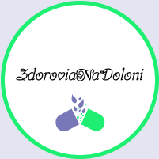

****
# :star2:  **Курсова робота**
# Предметна область: Аптека `ZdoroviaNaDoloni`

#### :scroll: У сучасному світі зростає попит на швидкі способи здійснення покупок. Клієнти віддають перевагу зручним платформам, що завжди під рукою і дозволяють швидко та зручно замовляти товари з будь-якого місця, не виходячи з дому. У цьому контексті створення мобільного застосунку для мережі аптек є актуальною та перспективною задачею.
#### Метою роботи є полегшення процесу покупок та підвищення задоволеності всіх видів клієнтів, а саме: гостів, зареєстрованих користувачів та провізорів. 
#### Лідерами серед програмних аналогів є :
- МІС Аптека 9-1-1;

- застосунок Tabletki.ua: пошук ліків;

- та сервіс PharmEasy - Healthcare App.

#### Для розробки програмного забезпечення заданої предметної області використано мову C# та Windows Forms з інтерфейсом Android-екрану користувача. 
#### Застосовано інкапсуляцію, статичні члени класів, інтерфейсів, абстрактних класів, спадкування, поліморфізму, .NET делегати і події, сереалізацію/десереалізацію у файли .json, Collections.Generic, запити LINQ.
#### Додатково використано підключення до бази даних phpMyAdmin, шаблони проєктування, додавання карти Google-map, створення об’єктів офісних документів за допомогою COM серверу.
#### Написано Telegram Bot на мові Python з використанням WebApp.
#### Докладна інформація у вигляді презентації та відео за посиланням: https://drive.google.com/drive/folders/1BmJ_esZc9PIM9NpgiP8vf2Hfl4j_lTgA
#### В подальшому ідея цього сервісу може стати конкурентною перевагою для мереж аптек, привертаючи користувачів та підвищуючи їхню лояльність.
### **Дякую за увагу!**
****
